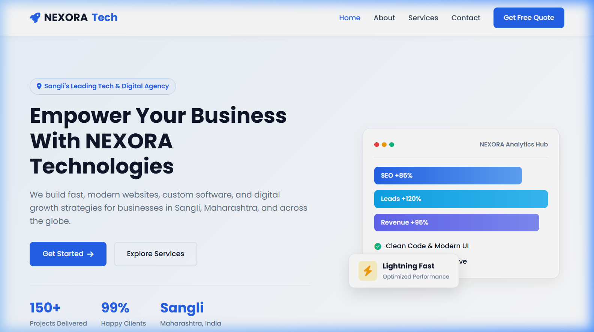
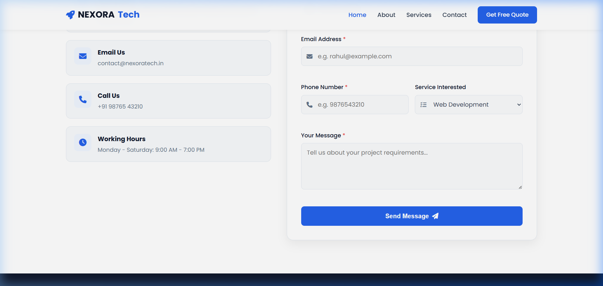

# Task 2: Responsive Business Landing Page - NEXORA Technologies

A modern, responsive, and beginner-friendly business landing page built for **NEXORA Technologies**, an IT & digital services agency based in **Shivaji Nagar, Sangli, Maharashtra, India**.

---

## 📌 Project Overview

This project is built using semantic **HTML5**, clean **CSS3** (Flexbox & CSS Grid), and lightweight vanilla **JavaScript**. It is designed to clearly communicate business value, engage visitors with interactive cards and buttons, and adapt seamlessly across all device screen sizes.

### 🏢 Business Profile
- **Company Name**: NEXORA Technologies
- **Location**: Shivaji Nagar, Sangli, Maharashtra 416416, India
- **Services Offered**: Web Development, UI/UX Design, Mobile App Development, SEO & Digital Marketing, E-Commerce Solutions, and Cloud Maintenance.
- **Contact Email**: contact@nexoratech.in
- **Contact Phone**: +91 98765 43210

---

## ✨ Key Features

1. **Sticky & Responsive Navigation Bar**:
   - Brand logo (`NEXORA Tech`) with rocket icon.
   - Smooth navigation links (`Home`, `About`, `Services`, `Contact`).
   - Quick "Get Free Quote" CTA button.
   - Mobile hamburger toggle menu (< 768px) that automatically collapses upon link selection.

2. **Hero Section (Above the Fold)**:
   - High-impact value proposition headline for Sangli and global businesses.
   - Primary & Secondary Call-to-Action buttons (`Get Started`, `Explore Services`).
   - Trust statistics bar (`150+ Projects Delivered`, `99% Happy Clients`, `Sangli, Maharashtra`).
   - Clean analytics visual card with CSS chart bars and animated floating badge.

3. **About Us Section**:
   - Agency mission narrative and 4-point verified checklist.
   - 4 Feature highlights: *Expert Engineers*, *On-Time Delivery*, *Secure & Reliable*, and *24/7 Dedicated Support*.

4. **Services Section (6-Card Grid)**:
   - Responsive grid with hover lift animation and icon transitions.
   - 6 Core services:
     1. Web Development
     2. UI/UX Design
     3. Mobile App Development
     4. SEO & Digital Marketing
     5. E-Commerce Stores
     6. Cloud & Maintenance

5. **Interactive Contact Form & Office Info**:
   - Office contact cards with address in Sangli, email, phone, and business hours.
   - Contact form with real-time JavaScript validation for Name, Email, Phone, Service selection, and Message.
   - Dynamic green success feedback alert after successful submission.

6. **Modern Footer**:
   - Social media links (LinkedIn, GitHub, Twitter, Instagram).
   - Quick navigation links & services directory.
   - Copyright & location info.

---

## 📂 Folder Structure

```
business-landing-page/
├── index.html                # Semantic HTML structure & sections
├── css/
│   └── style.css             # Clean, well-commented styling & media queries
├── js/
│   └── script.js             # Mobile navigation & form validation logic
├── images/                   # Screenshots and assets
│   ├── desktop-hero-view.png
│   ├── desktop-services-view.png
│   ├── desktop-contact-view.png
│   └── mobile-hero-view.png
└── README.md                 # Project documentation
```

---

## 📸 Output Screenshots

### 1. Desktop Hero Section View (1280x800)


### 2. Desktop Services Section View


### 3. Desktop Contact Form & Info View


### 4. Mobile Hero View (375x667)


---

## 🚀 How to Run Locally

1. Clone or download this repository.
2. Navigate to the `business-landing-page/` directory.
3. Open `index.html` in any web browser (Google Chrome, Microsoft Edge, Firefox).
4. Alternatively, use the **Live Server** extension in VS Code.
