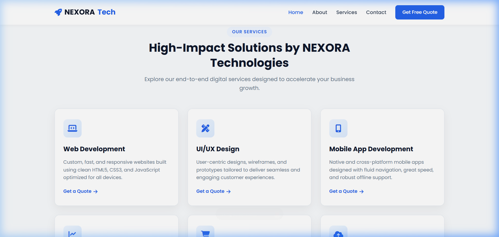
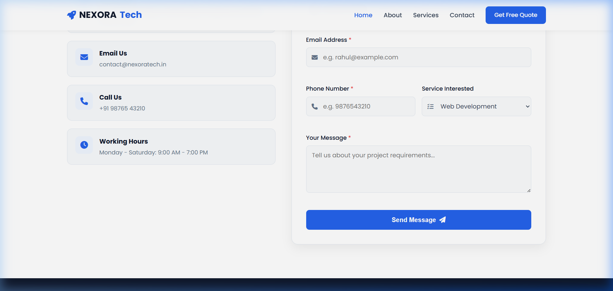

# Task 2: Responsive Business Landing Page - NEXORA Technologies

A modern, high-converting responsive business landing page built for **NEXORA Technologies**, a digital solutions and IT services company based in **Shivaji Nagar, Sangli, Maharashtra, India**.

---

## 🎯 Objective

To build a professional, responsive, and performance-optimized business landing page that clearly presents NEXORA Technologies' service offerings, agency value propositions, client trust statistics, and provides an interactive contact pipeline for client inquiries.

---

## 🛠️ Tech Stack

- **Frontend**: Semantic HTML5, Vanilla CSS3 (Flexbox & CSS Grid), Vanilla JavaScript (ES6+)
- **Icons & Typography**: Google Fonts (Poppins), Font Awesome 6 Icons
- **Version Control & Hosting**: Git, GitHub, GitHub Pages

---

## ✨ Features Implemented

1. **Sticky Navigation Bar**:
   - Brand logo with rocket icon and responsive navigation links (`Home`, `About`, `Services`, `Contact`).
   - Call-to-action button (`Get Free Quote`).
   - Mobile hamburger drawer that toggles smoothly and closes on link click.

2. **Hero Section (Above the Fold)**:
   - Compelling value-driven headline for global and local businesses in Sangli.
   - Dual CTA buttons (`Get Started`, `Explore Services`).
   - Key business metrics bar (`150+ Projects`, `99% Happy Clients`, `Sangli, Maharashtra`).
   - Analytics visual card with custom CSS animated chart bars.

3. **About Us & Agency Highlights**:
   - Agency narrative with 4 key verification items: *Expert Engineers*, *On-Time Delivery*, *Secure Architecture*, and *24/7 Support*.

4. **Services Section (6-Card Responsive Grid)**:
   - 6 core services: Web Development, UI/UX Design, Mobile Apps, SEO & Digital Marketing, E-Commerce Stores, and Cloud & Maintenance.
   - Hover lift effects, glowing icons, and clean typography.

5. **Interactive Contact Form & Local Office Info**:
   - Office contact cards: Sangli address, direct email, phone, and operating hours.
   - Full JavaScript form validation with dynamic inline feedback and success message banner.

6. **Comprehensive Footer**:
   - Social channels (LinkedIn, GitHub, Twitter, Instagram), quick navigation links, and copyright info.

---

## 📂 Folder Structure

```text
business-landing-page/
├── index.html                # Semantic HTML structure & sections
├── css/
│   └── style.css             # Clean stylesheet with Flexbox, Grid, & media queries
├── js/
│   └── script.js             # Hamburger toggle & form validation logic
├── images/                   # Local assets & image previews
│   ├── desktop-hero-view.png
│   ├── desktop-services-view.png
│   ├── desktop-contact-view.png
│   └── mobile-hero-view.png
└── README.md                 # Project documentation
```

---

## 🚀 Setup & Run Instructions

1. Clone the repository:
   ```bash
   git clone https://github.com/vighnesh1310/WeIntern-Week-1-Assignment.git
   ```
2. Navigate to the `business-landing-page` directory:
   ```bash
   cd WeIntern-Week-1-Assignment/business-landing-page
   ```
3. Open `index.html` in any web browser (Google Chrome, Microsoft Edge, Mozilla Firefox) or use **VS Code Live Server**.

---

## 🌐 Live Project Link

- **Live Demo**: [https://vighnesh1310.github.io/WeIntern-Week-1-Assignment/business-landing-page/](https://business-landing-page-umber.vercel.app/)
- **GitHub Repository**: [https://github.com/vighnesh1310/WeIntern-Week-1-Assignment](https://github.com/vighnesh1310/WeIntern-Week-1-Assignment)

---

## 📸 Screenshots

### 1. Desktop Hero Section View


### 2. Mobile Hero & Navigation View


### 3. Services 6-Card Grid View


### 4. Contact Form & Office Location View


---

## 👤 Author Details

- **Author**: Vighnesh Laxman Kadam
- **Role**: Full Stack Web Development Intern
- **Program**: WeIntern Internship - Week 1 Assignment
- **GitHub**: [@vighnesh1310](https://github.com/vighnesh1310)
- **Location**: Sangli, Maharashtra, India
