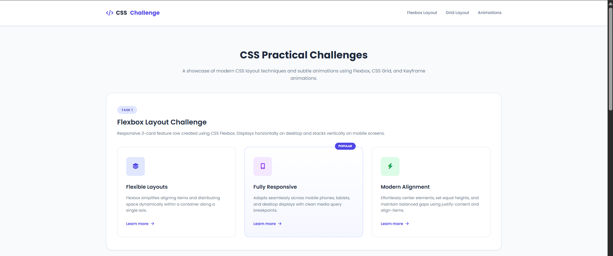
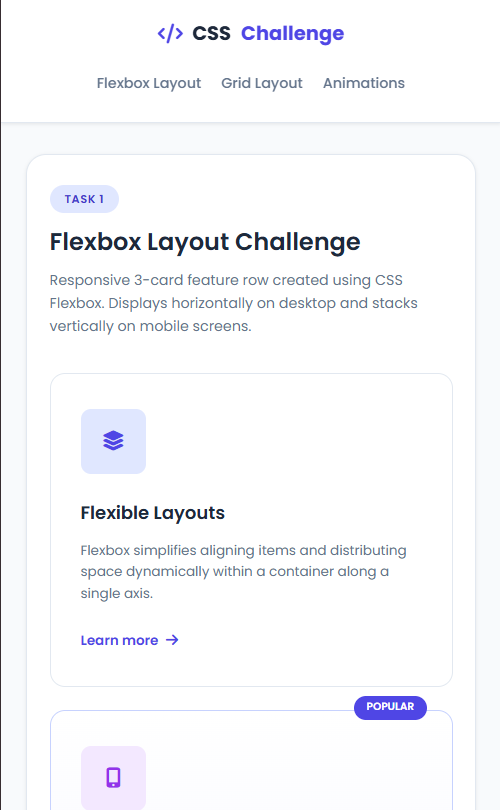
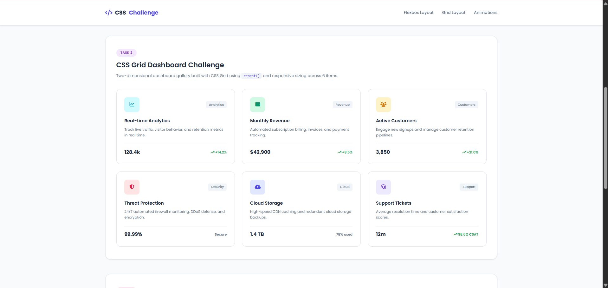
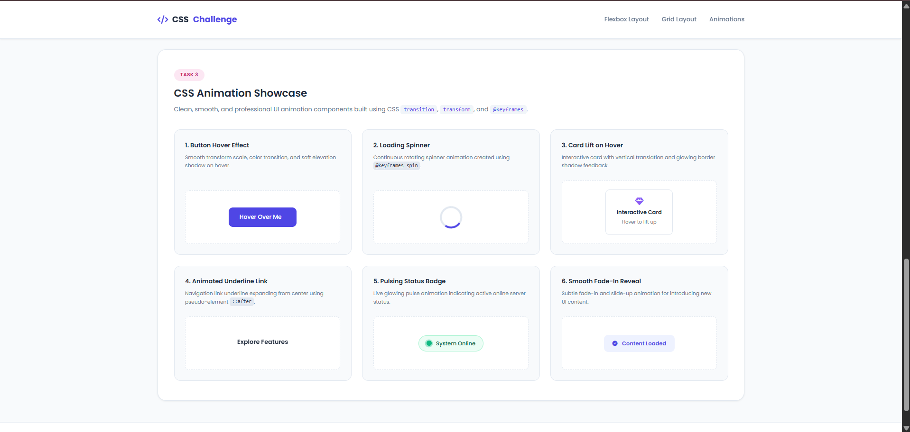

# Task 3: CSS Challenge - Flexbox, Grid & Animations

A practical collection of modern CSS layout and keyframe animation exercises built using semantic HTML5 and vanilla CSS3.

---

## 🎯 Objective

To demonstrate mastery over core CSS layout mechanisms (Flexbox and CSS Grid) and keyframe animation techniques by creating responsive, accessible, and subtle interactive UI components across varying viewport sizes.

---

## 🛠️ Tech Stack

- **Frontend**: Semantic HTML5, Vanilla CSS3 (Flexbox, CSS Grid, Transitions, Keyframes)
- **Icons & Typography**: Google Fonts (Poppins), Font Awesome 6 Icons
- **Version Control & Hosting**: Git, GitHub, GitHub Pages

---

## ✨ Features Implemented

1. **Flexbox Layout Challenge (`#flexbox`)**:
   - 3-card horizontal feature row built with `display: flex;`, `justify-content: space-between;`, and `align-items: stretch;`.
   - Equal-width flexible cards (`flex: 1; gap: 24px;`).
   - Seamless vertical stacking on mobile screens (`<= 768px`).
   - Smooth hover elevation feedback (`transform: translateY(-6px)`).

2. **CSS Grid Dashboard Challenge (`#grid`)**:
   - 6-item analytics and metric cards arranged in a two-dimensional grid.
   - Responsive multi-column layout (`repeat(3, 1fr)` on desktop, `repeat(2, 1fr)` on tablets, `1fr` on mobile).
   - Uniform spacing, consistent typography, and visual card styling.

3. **CSS Animation Showcase (`#animations`)**:
   - **Button Hover Effect**: Interactive transform scaling with box-shadow elevation.
   - **Loading Spinner**: Continuous infinite rotation via `@keyframes spin`.
   - **Card Lift Effect**: Interactive hover lift (`translateY(-8px)`) with cubic-bezier transition.
   - **Animated Underline Link**: Expanding underline from center using `::after` and `scaleX`.
   - **Pulsing Status Badge**: Glowing wave pulse effect with `@keyframes pulse`.
   - **Smooth Fade-In Reveal**: Content entrance animation with `@keyframes fadeIn`.

---

## 📂 Folder Structure

```text
css-challenge/
├── index.html                # Semantic HTML layout showcase
├── css/
│   └── style.css             # Flexbox, Grid, & keyframe animation styles
└── README.md                 # Project documentation
```

---

## 🚀 Setup & Run Instructions

1. Clone the repository:
   ```bash
   git clone https://github.com/vighnesh1310/WeIntern-Week-1-Assignment.git
   ```
2. Navigate to the `css-challenge` directory:
   ```bash
   cd WeIntern-Week-1-Assignment/css-challenge
   ```
3. Open `index.html` in any web browser (Chrome, Edge, Firefox, Safari) or use **VS Code Live Server**.

---

## 🌐 Live Project Link

- **Live Demo**: [https://vighnesh1310.github.io/WeIntern-Week-1-Assignment/css-challenge/](https://css-challenge.vercel.app/)
- **GitHub Repository**: [https://github.com/vighnesh1310/WeIntern-Week-1-Assignment](https://github.com/vighnesh1310/WeIntern-Week-1-Assignment)

---

## 📸 Screenshots

### 1. Flexbox Layout - Desktop View


### 2. Flexbox Layout - Mobile View (Stacked)


### 3. CSS Grid Layout - 6 Cards Dashboard View


### 4. CSS Animation Showcase Components


---

## 👤 Author Details

- **Author**: Vighnesh Laxman Kadam
- **Role**: Full Stack Web Development Intern
- **Program**: WeIntern Internship - Week 1 Assignment
- **GitHub**: [@vighnesh1310](https://github.com/vighnesh1310)
- **Location**: Sangli, Maharashtra, India
