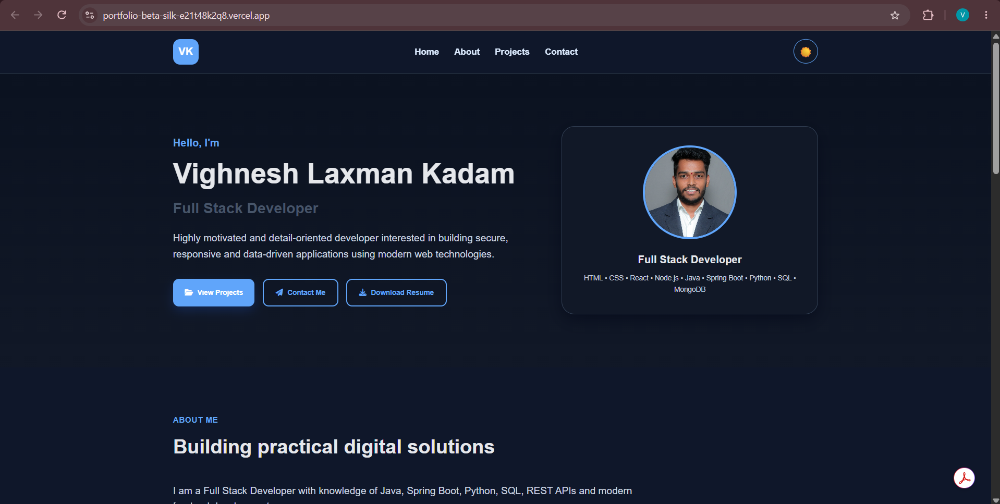
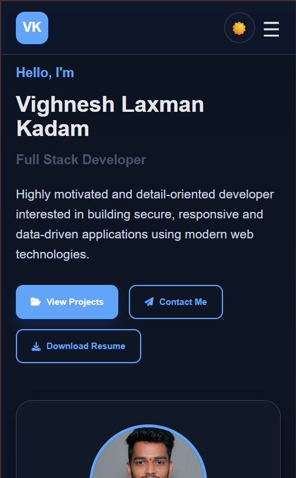
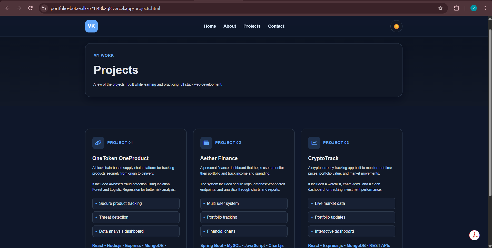
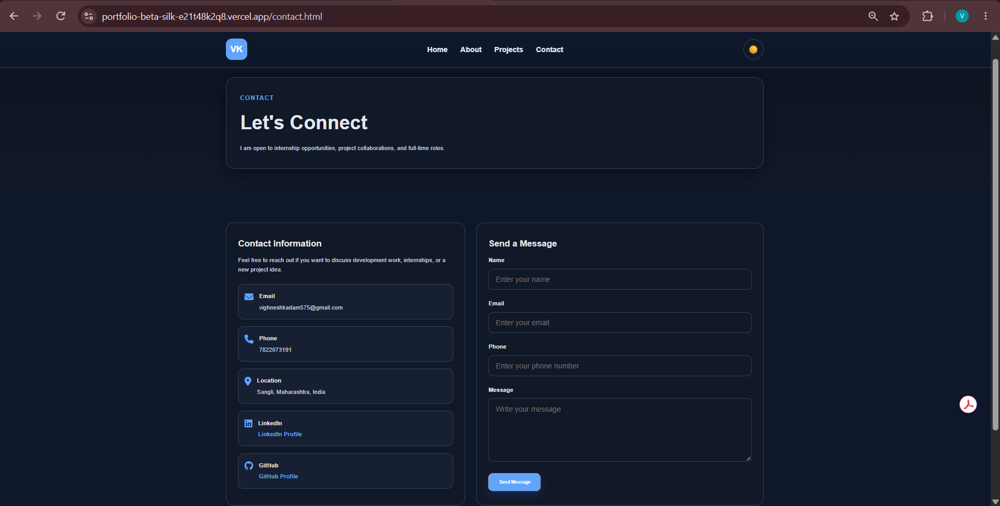

# Task 1: Personal Portfolio Website - Vighnesh Laxman Kadam

A modern, multi-page responsive personal portfolio website showcasing professional profile information, education, technical skills, featured projects, and an interactive contact form.

---

## 🎯 Objective

To design and develop an accessible, responsive, and aesthetically pleasing personal portfolio website using standard web technologies. The site serves as a comprehensive developer hub to present credentials, project demonstrations, downloadable resume, and contact channels.

---

## 🛠️ Tech Stack

- **Frontend**: Semantic HTML5, CSS3 (Flexbox, CSS Grid, Custom Variables), Vanilla JavaScript (ES6+)
- **Typography & Icons**: Google Fonts (Poppins), Font Awesome 6
- **Version Control & Hosting**: Git, GitHub, GitHub Pages

---

## ✨ Features Implemented

1. **Multi-Page Architecture**:
   - **Home (`index.html`)**: Interactive hero banner with animated role title, quick bio, profile avatar, and primary CTA buttons.
   - **About Me (`about.html`)**: Personal background story, academic timeline, technical skills matrix, and direct resume download.
   - **Projects (`projects.html`)**: Project gallery featuring live links, GitHub source links, project screenshots, and tech tags (Aether Finance, CryptoTrack, OneToken).
   - **Contact (`contact.html`)**: Functional contact form with client-side JavaScript validation, direct email/phone cards, and social links.

2. **Responsive Navigation & Mobile Drawer**:
   - Sticky navbar with active page indicators.
   - Hamburger menu drawer for mobile and tablet screen sizes (< 768px).

3. **Modern Styling & Theming**:
   - Consistent CSS custom properties (`--primary-color`, `--bg-dark`, `--shadow`, etc.).
   - Fluid responsive breakpoints using CSS Flexbox and Grid.
   - Interactive hover cards, smooth transitions, and focus outlines.

---

## 📂 Folder Structure

```text
portfolio-website/
├── index.html                # Homepage with hero & summary
├── about.html                # About page, education & skills matrix
├── projects.html             # Projects gallery & case studies
├── contact.html              # Contact form & social connections
├── css/
│   └── style.css             # Main stylesheet with responsive rules
├── js/
│   └── script.js             # Mobile drawer & form validation logic
├── assets/
│   ├── Vighnesh_Laxman_Kadam.pdf  # Downloadable resume
│   └── images/               # Project screenshots & profile avatar
│       ├── vighnesh_kadam.jpg
│       ├── aether-finance.png
│       ├── cryptotrack.png
│       └── onetoken.png
└── README.md                 # Project documentation
```

---

## 🚀 Setup & Run Instructions

1. Clone the repository:
   ```bash
   git clone https://github.com/vighnesh1310/WeIntern-Week-1-Assignment.git
   ```
2. Navigate to the `portfolio-website` folder:
   ```bash
   cd WeIntern-Week-1-Assignment/portfolio-website
   ```
3. Open `index.html` in any web browser (Chrome, Edge, Firefox, Safari) or launch via **VS Code Live Server**.

---

## 🌐 Live Project Link

- **Live Demo**: [https://vighnesh1310.github.io/WeIntern-Week-1-Assignment/portfolio-website/](https://portfolio-beta-silk-e21t48k2q8.vercel.app/)
- **GitHub Repository**: [https://github.com/vighnesh1310/WeIntern-Week-1-Assignment](https://github.com/vighnesh1310/WeIntern-Week-1-Assignment)

---

## 📸 Screenshots

### 1. Home Page - Desktop View


### 2. Home Page - Mobile View


### 3. Projects Showcase Page


### 4. Contact Page & Form Validation


---

## 👤 Author Details

- **Author**: Vighnesh Laxman Kadam
- **Role**: Full Stack Web Development Intern
- **Program**: WeIntern Internship - Week 1 Assignment
- **GitHub**: [@vighnesh1310](https://github.com/vighnesh1310)
- **Location**: Sangli, Maharashtra, India
